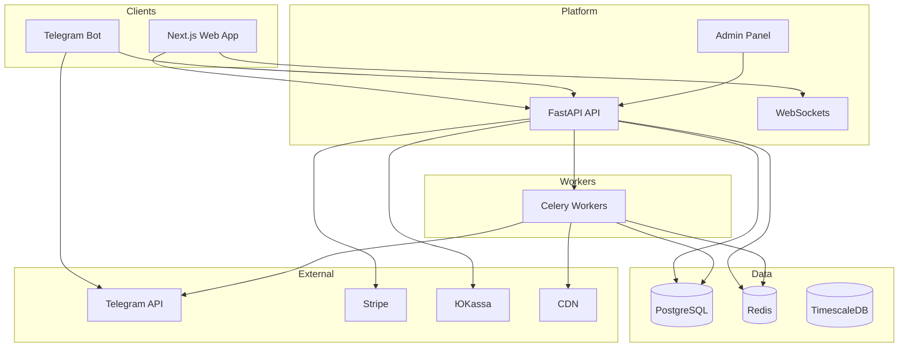

# LytSlot Pro — Multi-Channel Ad Platform

Детальное описание проекта, архитектуры, этапов разработки и стандартов для команды разработчиков.

---

## 1. Обзор проекта

### 1.1 Назначение

**LytSlot Pro** — масштабируемая SaaS-платформа для автоматизированной продажи рекламы в Telegram-каналах. Это не бот для одного канала, а **мульти-тенантная система**: тысячи клиентов регистрируют свои каналы, настраивают слоты и цены, управляют рекламой через веб-панель. Администраторы платформы мониторят всех клиентов и каналы.

### 1.2 Целевые масштабы

| Метрика | Цель |
|--------|------|
| Каналы | 1000+ |
| Заказы/день | 10 000+ |
| Клиенты | 1000+ (целевой рубеж) |
| Выручка | 5M₽/мес |

### 1.3 Бизнес-модель

- **Freemium**: 1 канал бесплатно.
- **Pro**: 20% от revenue + подписка (например, 10k₽/мес за 10 каналов).
- Платежи: Stripe (global), ЮKassa (RU); payouts владельцам каналов.

---

## 2. Ключевые функции (функциональные требования)

### 2.1 Мульти-каналы (клиент)

- Клиент добавляет свои каналы (@channel1, @channel2).
- Настройка слотов: шаг 15/30/60 мин.
- Цены: динамические (например, 500–5000₽/слот).
- Правила ККТУ/ERID для чеков и рекламы.

### 2.2 Клиентский веб-кабинет

- Регистрация через Telegram Login.
- Дашборд своих каналов.
- Аналитика: views, CTR, revenue.
- Управление API-ключами.

### 2.3 Универсальный бот

- **@LytSlotProBot** — один бот для всех клиентов.
- FSM: «Мои каналы → Выбрать слот → Заказ».
- Шардинг по каналам (dispatcher groups).

### 2.4 Админ-панель

- Супер-дашборд: все каналы, топ-клиенты.
- Revenue share 20%, отчёты.
- Модерация контента, блокировка нарушителей.

### 2.5 Продвинутые функции

- A/B-тесты креативов.
- Пакетные слоты.
- Подписки Pro (10k₽/мес за 10 каналов).
- Белый список рекламодателей.

### 2.6 Масштаб и инфраструктура

- Async очереди: Celery + Redis.
- Sharding БД (tenant_id).
- CDN для медиа.
- Мониторинг: Prometheus + Grafana.

---

## 3. Технологический стек

### 3.1 Backend

| Компонент | Технология | Назначение |
|-----------|------------|------------|
| API | FastAPI | Async API, WebSockets для дашборда |
| Очереди | Celery + Redis | Publish, уведомления |
| ORM | SQLAlchemy | Sharding по tenant_id |
| БД | PostgreSQL | Основное хранилище, Read Replicas |
| Аналитика БД | TimescaleDB | Метрики views, агрегаты по времени |
| Безопасность БД | Row-Level Security | Tenant isolation |

### 3.2 Бот

| Компонент | Технология |
|-----------|------------|
| Framework | aiogram 3.x |
| Масштабирование | Multi-bot sharding (dispatcher groups) |

### 3.3 Frontend

| Компонент | Технология |
|-----------|------------|
| Framework | Next.js 14 (App Router, Server Actions) |
| Стили | Tailwind CSS |
| UI | shadcn/ui |
| Календарь | FullCalendar Pro |
| Auth | Clerk / Telegram Auth |
| Data fetching | TanStack Query |
| Графики/состояние | Recharts, Zustand |

### 3.4 Платежи

- **Stripe** — международные платежи.
- **ЮKassa** — РФ.
- Multi-webhook, payouts владельцам каналов.

### 3.5 Инфраструктура

| Область | Технология |
|---------|------------|
| Контейнеры/оркестрация | Docker, Docker Swarm / Kubernetes |
| Хостинг | Render / AWS / DigitalOcean |
| Reverse proxy | NGINX |
| CDN / защита | Cloudflare (CDN, WAF, DDoS, rate-limit) |
| Мониторинг | Prometheus, Grafana |
| Ошибки | Sentry |
| IaC | Terraform |
| CI/CD | GitHub Actions |
| Медиа | CDN (Cloudinary и др.) |
| События продукта | PostHog |

### 3.6 Дополнительно

- Rate-limit: 100 req/min на пользователя.
- AI-модерация контента: Gemini/Claude API (опционально).

---

## 4. Архитектура системы

### 4.1 Высокоуровневая схема



### 4.2 Мульти-тенантность

- **Ключ изоляции**: `tenant_id` (владелец канала / организация).
- **Реализация**: sharding и/или партиционирование по `tenant_id`, Row-Level Security в PostgreSQL.
- Все запросы к данным привязываются к текущему tenant (из JWT/session).

### 4.3 Очереди и асинхронность

- **Redis**: кэш, брокер для Celery, сессии, rate-limit.
- **Celery**: публикация постов, рассылка уведомлений, тяжёлая аналитика, генерация отчётов.
- Критичные пути (создание заказа, слоты) — через API с минимальной синхронной валидацией; фоновые задачи — в Celery.

### 4.4 Безопасность

- Аутентификация: Telegram Login + JWT; админ — отдельные роли и проверки.
- Rate-limit (например, 100 req/min на пользователя) на уровне API/Cloudflare.
- Tenant isolation: ни один запрос не должен получать данные чужого tenant.
- Секреты и ключи платёжных систем — только в секретах окружения (env/vault).

---

## 5. Этапы разработки

### 5.1 MVP (4–6 недель)

- Регистрация (Telegram Login), базовая модель пользователь/канал/слот.
- Один бот: выбор канала → слот → заказ (FSM).
- Минимальный веб-кабинет: список каналов, слоты, заказы.
- Базовые платежи (один провайдер: ЮKassa или Stripe).
- Админ: просмотр каналов и заказов, ручная модерация.

### 5.2 Масштабирование (8–12 недель суммарно)

- Celery + Redis: публикация, уведомления.
- Sharding/RLS, Read Replicas при росте нагрузки.
- Полный дашборд аналитики (views, CTR, revenue).
- Подписки Pro, revenue share 20%.
- A/B креативов, пакетные слоты, белый список рекламодателей.
- Мониторинг (Prometheus/Grafana), Sentry, CDN для медиа.

### 5.3 Ресурсы

- Оценка: 2–3 разработчика, 8–12 недель до полнофункциональной версии; MVP — 4–6 недель.

---

## 6. Стандарты и поддерживаемость

### 6.1 Принципы

- **SOLID**, **KISS**, **DRY**.
- Единый стиль кода: линтеры (backend/frontend), форматтеры, pre-commit hooks.
- Удалять неиспользуемый код и устаревшие комментарии.

### 6.2 Документирование кода

- В начале каждого нового файла: `@file`, `@description`, `@dependencies`, `@created`.
- API: OpenAPI (FastAPI), актуальное описание эндпоинтов и моделей.
- Важные архитектурные решения и ограничения — в `docs/Diary.md`.

### 6.3 Консистентность

- Именование: единый стиль (snake_case для Python, camelCase для JS/TS в API-контрактах — по соглашению команды).
- Структура репозитория: **монорепо** (см. п. 6.4).
- Обновлять **docs/Project.md** при изменении архитектуры или добавлении значимых функциональных требований.

### 6.4 Структура монорепо (LytSlot Pro)

```
lytslot-pro/  (корень репозитория)
├── services/
│   ├── api/      # FastAPI: core API + admin, auth, WebSocket
│   ├── bot/      # aiogram 3.x multi-tenant bot
│   ├── worker/   # Celery: publish, analytics, webhooks
│   └── web/      # Next.js 14 (App Router, shadcn/ui)
├── infra/        # docker-compose.yml, k8s manifests, terraform
├── db/           # Alembic migrations, TimescaleDB schemas
├── shared/       # Pydantic models, общие типы (Python)
├── tests/        # pytest (unit/integration), Playwright E2E, locust
├── docs/
├── .env.example, docker-compose.prod.yml
```

- Изоляция по тенанту: tenant-per-channel; RLS в PostgreSQL по `app.tenant_id`.
- Масштаб: 10k orders/day; микросервисы api, bot, worker, web.

---

## 7. Связанные документы

| Документ | Назначение |
|----------|------------|
| [Tasktracker.md](Tasktracker.md) | Отслеживание прогресса, приоритеты задач |
| [Diary.md](Diary.md) | Дневник решений, наблюдений и проблем |
| [changelog.md](changelog.md) | Журнал изменений по датам |
| [qa.md](qa.md) | Вопросы по архитектуре и требованиям |

---

*Документ обновляется при изменении архитектуры или добавлении новых функциональных требований.*
